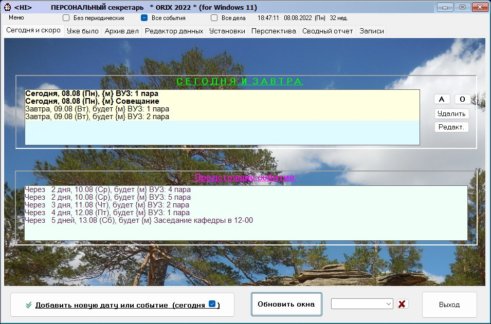

# ORIX 2022

Программа является многофункциональным продуктом, незаменимым для секретарей, 
менеджеров и руководителей малых и средних предприятий. 
Основная функция программы – это планирование, учет, оптимизация и контроль 
рабочего и свободного времени  разрезе дней, событий и дел. 
Программа позволяет находить свободные и наиболее занятые дни, 
выдавать сводные отчеты о предстоящих праздниках и событиях, 
наглядно видеть срочные, а также выдавать задания,
 срок исполнения по которым истек. Существует возможность 
сохранения выполненных заданий в архиве.

Настройки программы позволяют изменять диапазон отображения дел,
 событий и перспектив в широких пределах, как до, 
так и после текущей даты. В программе существует возможность 
ведения записной книжки с разделами и поиском, а также возможность 
cоздания и работы с различными профилями пользователя.

